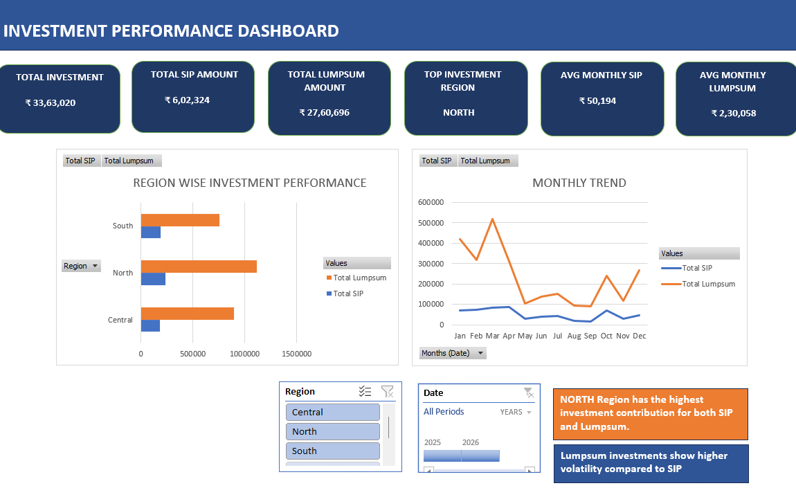

# 📊 Investment Performance Dashboard (Excel)

## 📌 Overview

This project is an Excel-based MIS dashboard designed to analyze SIP and Lumpsum investment performance across regions and time.

## 🎯 Key Features

* Region-wise investment analysis
* Monthly trend analysis
* Interactive slicers (Region & Date)
* KPI metrics (Total Investment, Avg SIP, Avg Lumpsum)

## 🛠 Tools Used

* Microsoft Excel
* Pivot Tables
* Charts (Bar & Line)
* Slicers

## 📈 Insights

* North region has the highest investment contribution
* Lumpsum investments show higher volatility compared to SIP investments
* Monthly trends help identify peak investment periods

## 📷 Dashboard Preview

## 📂 Files Included

* MIS_Dashboard_Project.xlsx
* dashboard.png

## 🚀 About Me

Aspiring Data Analyst with experience in MIS reporting and strong interest in data analysis and visualization.

